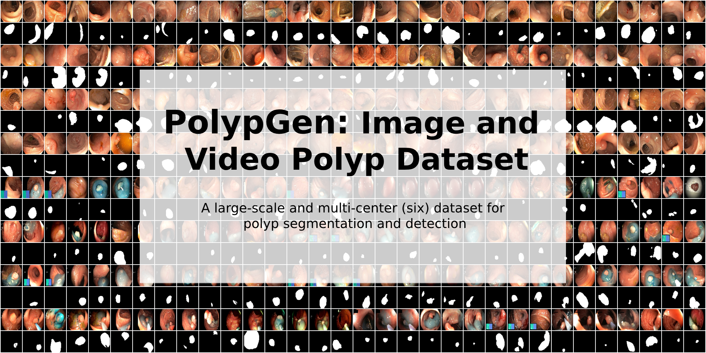
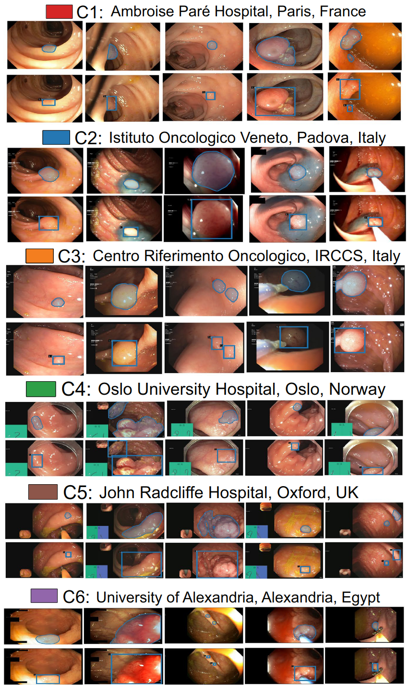

# PolypGen: A multi-centre polyp detection and segmentation dataset for generalisability assessment

Please feel free to **download PolypGen dataset** by using https://www.synapse.org/#!Synapse:syn26376615/wiki/613312

Please find the link for the **video sequence**. 

https://drive.google.com/drive/folders/16uL9n84SrMt7IiQFzTUQNaJ9TbHJ8DhW?usp=sharing

The dataset contains still images, video sequences, positive and negative-only frames from 6 medical hospitals. It is one of the most comprehensive publicly available datasets. The PolypGen dataset is an open-access dataset that comprises 1,537 polyp images, 2,225 positive video sequences, and 4,275 negative frames. The dataset is collected from six different centers in Europe and Africa. Altogether the dataset provides 3,762 positive frames and 4,275 negative frames. These still images and video frames are collected from varied populations, endoscopic systems, and surveillance expert in  Norway, France, United Kingdom, Egypt, and Italy and is one of the comprehensive open-access datasets for polyp detection and segmentation. 

# Dataset examples

Sample polyp annotations from each center: Segmentation area with boundaries and corresponding bounding box/boxes overlaid images from all six centers. Samples include both small sized polyp (<10000 pixels) including some flat polyp samples to large sized (≥40000 pixels) polyps and polyps during resection procedure such as polyps with blue dyes.

  
  PolypGen dataset: (a) Positive (both single and sequence frames) and negative samples (sequence only) from each center, and (b) polyp size-based histogram plot for positive samples showing variable-sized annotated polyps in the dataset (small is ≤100 × 100 pixels; medium is >100 × 100 ≤200 × 200, and large is >200 × 200 pixels). Null represents no polyp present in the sample.
  
  
t-SNE plot for positive samples: 2D t-SNE embedding of the “PolypGen” dataset based on deep autoencoder extracted features. Each point is an image in the positive samples of the dataset. For each of the six boxed regions (dashed black lines) 25 images were randomly sampled for display in a 5 × 5 image grid. Here, the 1st boxed region represents mostly the sequence data. Interestingly, the 3rd, the 4th, and the 6th boxed regions mostly represent both polyp and non-polyp data and are heterogeneously distributed. Samples from 2nd and the 5th boxed regions shows mostly protruded polyps but with differently positioned endoscopy locations. Some samples in these also include the colonoscopy frames with dyes.

# Baseline results

The state-of-the-art results on each center of PolypGen and video sequence dataset can be found here:
[Transformer-based Residual Network for Polyp Segmentation with Multi-Center Out-of-Distribution Testing](https://arxiv.org/abs/2303.07428)

# Citation
Please cite our paper if you find the work useful: 
<pre>
@article{ali2023multi,
  title={A multi-centre polyp detection and segmentation dataset for generalisability assessment},
  author={Ali, Sharib and Jha, Debesh and Ghatwary, Noha and Realdon, Stefano and Cannizzaro, Renato and Salem, Osama E and Lamarque, Dominique and Daul, Christian and Riegler, Michael A and Anonsen, Kim V and others},
  journal={Scientific Data},
  volume={10},
  number={1},
  pages={75},
  year={2023}
</pre>

# Contact
Please contact Sharib Ali (s.s.ali@leeds.ac.uk) and Debesh Jha (debesh.jha@northwestern.edu) for further questions on the dataset/baseline results or for commercialization.

